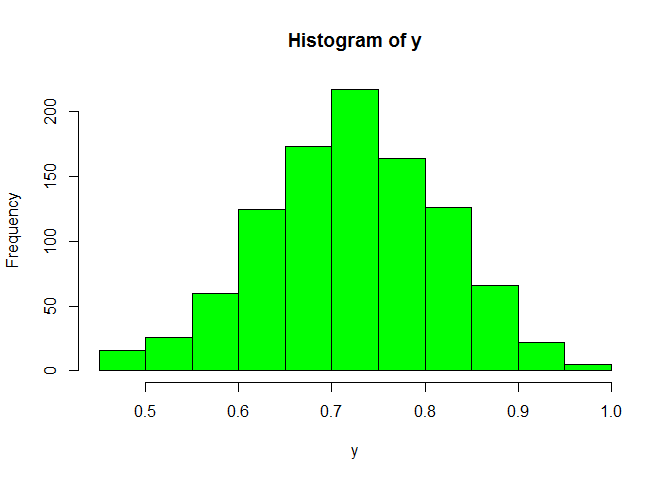
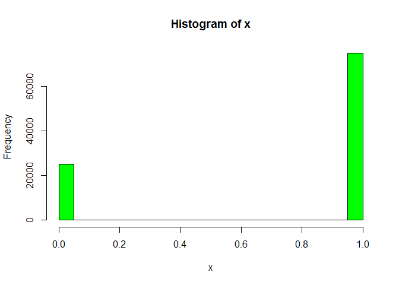

# Binomial Sampling
Cody Frisby  
October 6, 2015  
Let's say the true proportion yield is 0.75. 
What's the sampling distribution for a yield such as this?
It will vary depending on the size of sample we take.
Here I'm simulating a sample of size 20 from a very large population
of 100000.  I'm taking 1000 samples from this population of size 20.

```r
x <- rbinom(100000,1,0.75)
xbar <- NULL
for (i in 1 : 1000) xbar <- c(xbar, mean(sample(x,20)))
mean(x)
```

```
## [1] 0.75054
```

```r
mean(xbar)
```

```
## [1] 0.7499
```

```r
quantile(xbar, c(0.025, 0.975))
```

```
##  2.5% 97.5% 
##  0.55  0.95
```

Here's the distributions of the population and the means
  

But, what if we change some of the inputs.  Say, the number of samples gets smaller but the size of the samples gets larger.

```r
x <- rbinom(100000,1,0.75)
xbar <- NULL
for (i in 1 : 100) xbar <- c(xbar, mean(sample(x,50)))
mean(x)
```

```
## [1] 0.74884
```

```r
mean(xbar)
```

```
## [1] 0.7568
```

```r
quantile(xbar, c(0.025, 0.975))
```

```
##   2.5%  97.5% 
## 0.6295 0.8800
```

 
