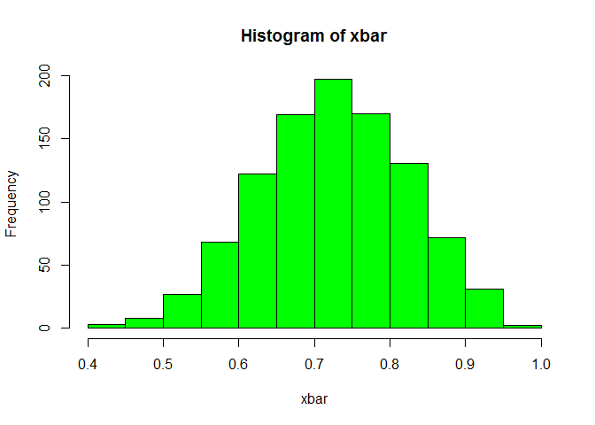

# Binomial Sampling
Cody Frisby  
October 6, 2015  
Let's say the true proportion yield is 0.73. 
What's the sampling distribution for a yield such as this?
It will vary depending on the size of sample we take.
Here I'm simulating a sample of size 20 from a very large population
of 100000.  I'm taking 1000 samples from this population of size 20.

```r
x <- rbinom(100000,1,0.75)
xbar <- NULL
for (i in 1 : 1000) xbar <- c(xbar, mean(sample(x,20)))
mean(x)
```

```
## [1] 0.75186
```

```r
mean(xbar)
```

```
## [1] 0.7524
```

```r
quantile(xbar, c(0.025, 0.975))
```

```
##  2.5% 97.5% 
##  0.55  0.95
```

  
